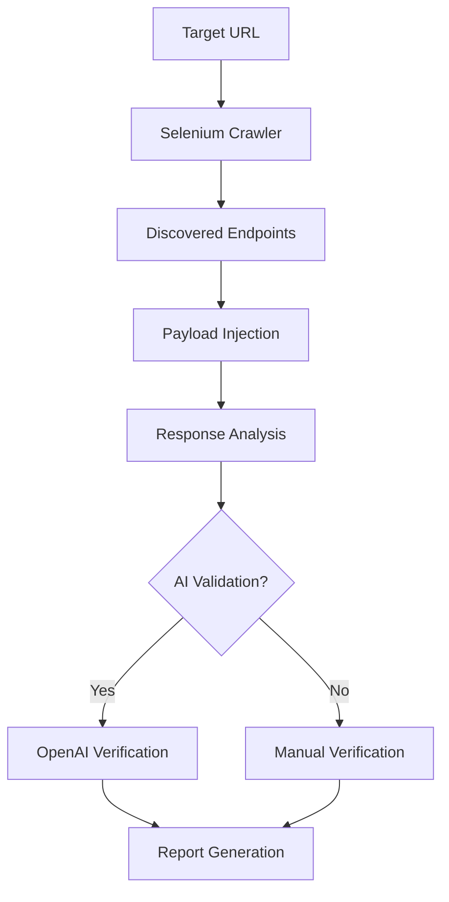

# 🔍 Advanced AI-Powered Web Vulnerability Scanner


> An intelligent web vulnerability scanner combining AI analysis with dynamic crawling and fuzzing techniques.

---

## 🚀 Features

- **AI-Powered Validation**  
  → Uses OpenAI GPT-3.5 Turbo for advanced response analysis and vulnerability triage.  
- **Smart Dynamic Crawling**  
  → Selenium-based browser automation to explore all reachable paths.  
- **OWASP Top 10 Coverage**:
  - Cross-Site Scripting (XSS)
  - SQL Injection (SQLi)
  - Remote Command Execution (RCE)
  - Server-Side Request Forgery (SSRF)
  - Path Traversal
  - Command Injection
  - Security Misconfigurations
- **WAF Evasion Techniques**:
  - Dynamic payload obfuscation
  - Multiple encoding strategies
- **Comprehensive Reporting**:
  - Outputs in **JSON** and **HTML**
  - Includes **OWASP Risk Scoring**

---

## 📦 Installation

### Prerequisites

- Python 3.7+
- Google Chrome or Chromium
- OpenAI API Key

### Steps

```bash
# Clone the repository
git clone https://github.com/yourusername/web-vuln-scanner.git
cd web-vuln-scanner

# Install dependencies
pip install -r requirements.txt

# Set your OpenAI API Key
echo "OPENAI_API_KEY=your_api_key_here" > .env

```



```bash
python scanner.py -u https://example.com -d ./payloads/ -m 3
```

